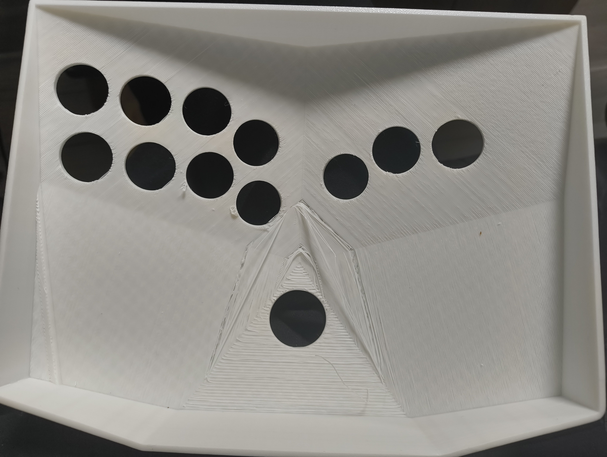
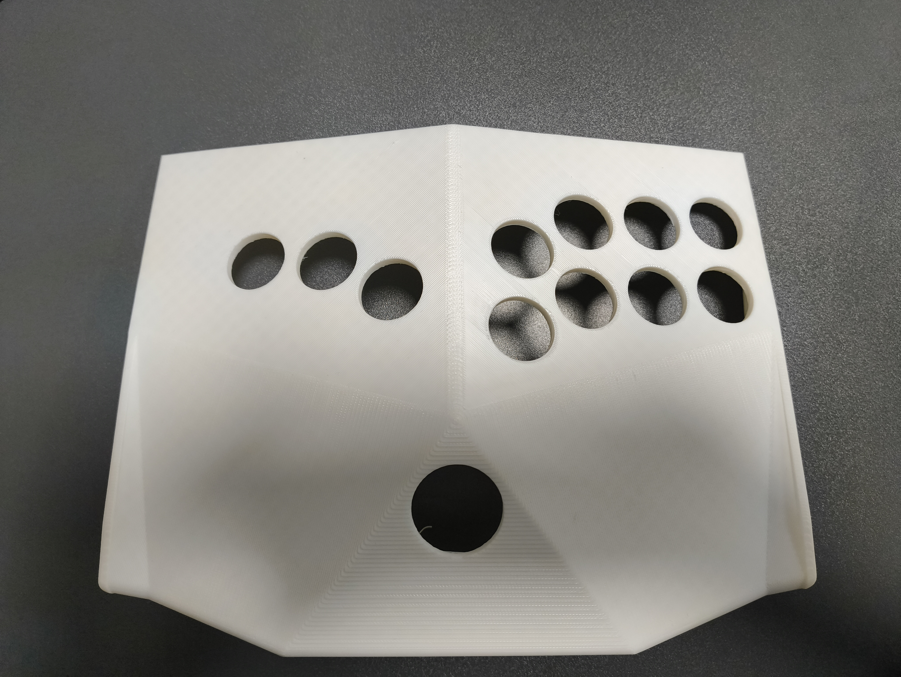
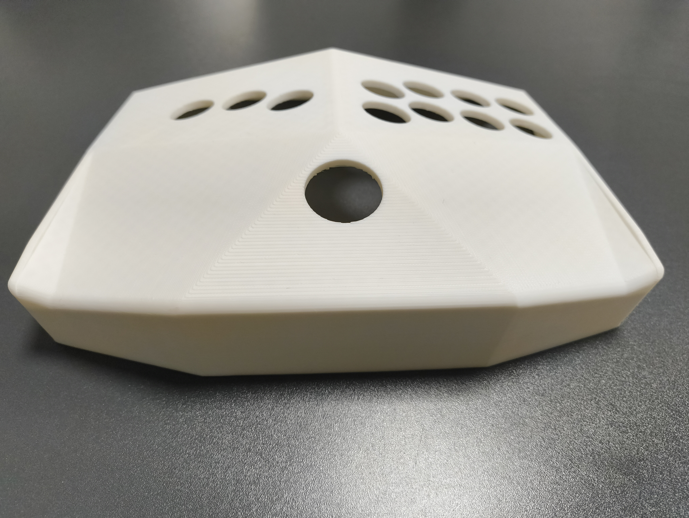
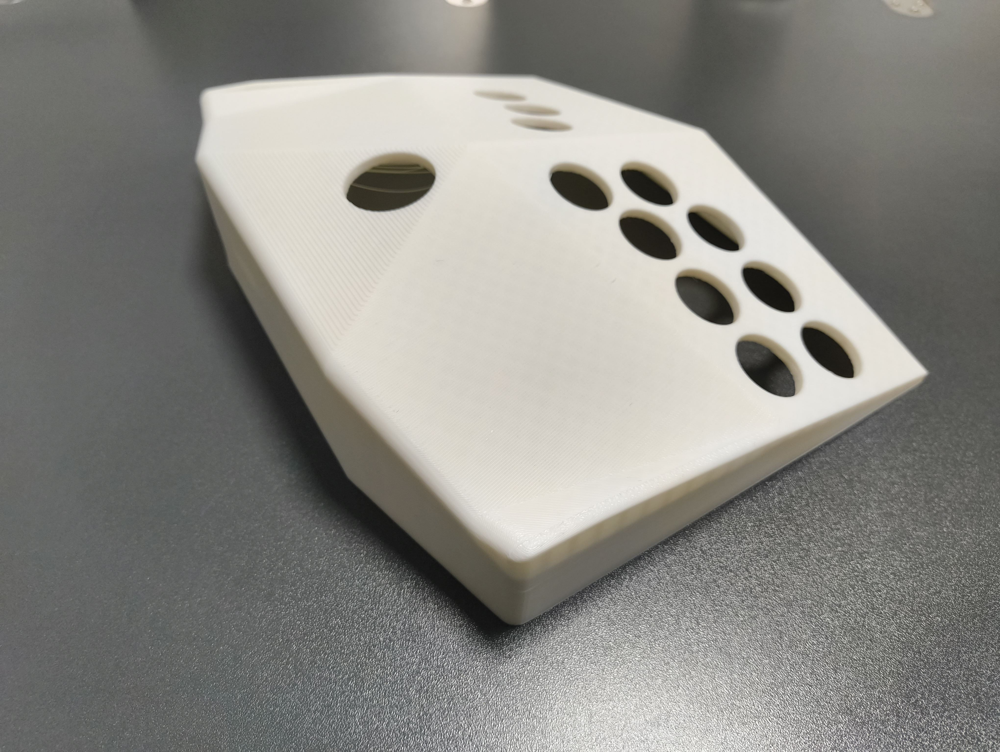
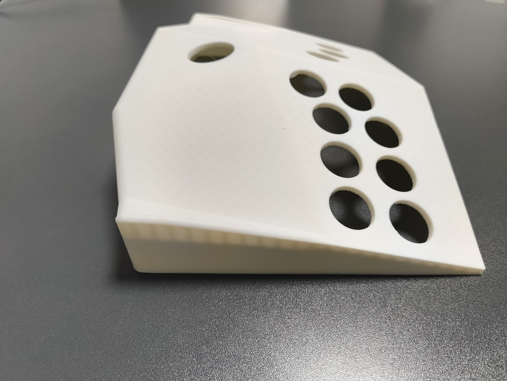

# 自作レバーレス製作記 Vol.2：一体成形で「全部入り」を試みたら、印刷が地獄だった話

こんにちは。
前回の記事（Vol.1）では、v1試作機でテンティングだけを入れたら手が滑って手首が痛くなった、という失敗を書きました。

今回はその反省を活かして作った**2号機（v2）** の記録です。
結論から言うと、エルゴノミクス的な仮説は前進したのですが、**3Dプリント製造の壁** に当たりました。

※この記事も完成報告ではなく、試作の**メモ／ログ** です。数値や結論は現時点の体感・観察にもとづく**暫定** として書きます。

## v1の振り返りと、v2に向けた仮説

v1でわかったのはこの2点でした。

- テンティング（左右の傾き）だけでは手が滑り落ち、踏ん張りが必要になる
- 前後方向の傾き（チルト）がないと、手首が強く反って痛い

これを踏まえて、v2では **「とにかく全部まとめて試してみよう」** という方針で設計しました。

仮説はシンプルに。

> **テンティング＋ハの字（開き角）を一体成形で組み込んだら、v1の問題は解消するのでは？**

v1は左右のユニットが完全に分割されていたのに対し、v2は**一体成形（モノコック構造）** を採用。
複数パーツの接合ズレをなくし、全体の剛性を上げることも狙いました。

## v2で作ったもの

出力したのはこんな形です。

*設計時点の上面。ハの字に広がるボタン配置と、中央の三角形のジャンプボタンエリアが見える。*

*実際に出力したv2の上面。8角形ベースの一体成形。左に移動ボタン3個、右にアクションボタン群、中央下にジャンプボタン。*

テンティングとハの字を両方入れた形状は、見た目にも「山型」の立体感があります。

*斜め前から見たところ。中央に向かって盛り上がる山形のテンティングが一目でわかる。*

## やってみてわかった2つの問題

### 1. 3Dプリントが大変すぎる

一体成形にしたことで、**天板の裏側が広範囲にわたってオーバーハング（宙に浮いた状態）** になりました。
サポート材（支え）を使って印刷したのですが、フィラメントが垂れ下がって裏面がかなり荒れてしまいました。

*左側面から見たところ。このテンティング角度が、裏面のオーバーハングを生み出していた。*

さらに**印刷時間がとにかく長い**。
一体成形で複雑な形状を平置きで出すには、サポートが大量に必要で、出力時間が膨大になりました。

現象を整理すると：
- **現象**: 裏面オーバーハングにサポートを充填したが、表面が荒れ、ナット締結部の座面が不安定になる
- **原因仮説**: 「平置き出力＋Treeサポート」では、広い傾斜面を均一に支えきれない
- **対策**: 現在検討中。印刷方向の変更やサポート設定の見直しなど、いくつか試してみたい案はある

*右斜め前から。テンティングで高さが出た分、側面の積層が長くなる。*

### 2. 形状的な課題も出てきた

印刷の問題とは別に、手に当ててみると形状的な課題も見えてきました。

**親指（ジャンプボタン）が他の指と同じ高さにある問題です。**

v2では、ジャンプボタンを含めてすべてのボタンが同一の面上にあります。
実際に手を置いてみると、親指は自然に「他の指より少し低い位置・手前方向」に向かって動くのに、
ボタンが同じ高さにあるせいで CM関節（親指の付け根）に負担がかかる感覚がありました。

また、**ボタン全体の位置が手前すぎる** という問題も。
手首をパームレスト部分に乗せた状態では、指の届く範囲とボタン位置がずれていて、少し窮屈に感じました。

## 次の試作（v3）に向けて

v2で見えてきた課題をざっくり整理すると、こんな感じです。

**製造面**
- テンティング形状を平置きで印刷するのは、サポート材の扱いがかなり難しい
- 印刷方向やサポート設定を変えるといいのかもしれないが、まだ答えは出ていない

**形状面**
- 親指ボタンの高さは、他の指とは分けて考える必要がありそう
- ボタン全体の位置も、もう少し奥にした方が自然に手が届く気がする

v1→v2で「テンティング＋ハの字の組み合わせ」という方向性は正しいと感じました。
ただ、製造のハードルと形状の細かい詰めが、思ったより残っている状態です。

---

**暫定の学び**
- テンティング＋ハの字の組み合わせ：体感として正しい方向（継続）
- 平置き印刷：テンティング形状との相性が悪い。対策は引き続き模索中
- 親指の高さ：同一面上に置くのは無理がある

**次に試してみたいこと**
- 印刷方向やサポート設定を変えてオーバーハング問題を回避できないか検証
- 親指ボタンを一段下げたレイアウトを試す
- ボタン位置全体を少し奥にずらす
- 外形を台形にしてパームレストを広げる

また進捗があれば報告します。
